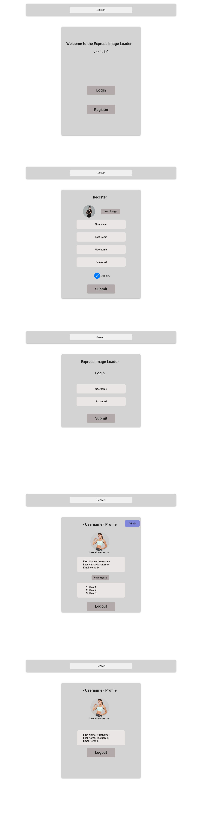

# Full Stack Express Application with JwT / Sessions / PassportJS local Startegy / GOOGLE OAUTH 2.0

## Summary
Application implements a fullstack Express Application with DB (MongoDB), authorization (JwT, with cookie), and Google OAUTH 2.0

## Folder Structure - Express (Full-Stack)

```
├─ .env
├─ .gitignore
├─ .npmrc
├─ ReadMe.md
├─ buildspec.yml
├─ package.json
├─ public
│  ├─ favicon.ico
│  ├─ image
│  ├─ scripts.js
│  └─ style.css
└─ src
   ├─ app.js
   ├─ controllers
   │  └─ loaderControllers.js
   ├─ db
   │  └─ index.js
   ├─ index.js
   ├─ middleware
   │  └─ loaderRoute
   │     ├─ authAdmin.js
   │     ├─ authGeneral.js
   │     └─ formValidator.js
   ├─ migration
   │  └─ loader
   │     ├─ loaderMigration.js
   │     └─ logs
   ├─ models
   │  └─ loader
   │     ├─ index.js
   │     └─ loaderMethod.js
   ├─ routes
   │  └─ loaderRoutes.js
   ├─ seeders
   │  └─ admin.js
   ├─ services
   │  ├─ jwtService.js
   │  └─ passport.js
   ├─ utils
   │  ├─ bcryptFunctions.js
   │  └─ verifyFunction.js
   └─ views
      ├─ admin.hbs
      ├─ error.hbs
      ├─ index.hbs
      ├─ login.hbs
      ├─ partials
      │  └─ header.hbs
      ├─ register.hbs
      └─ user.hbs
```

## Mockup of Complete Application


## License
Free to use. Kindly acknowledge owner
